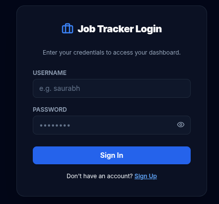
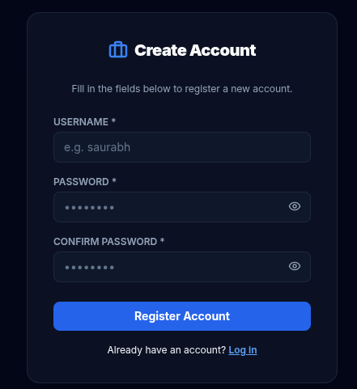
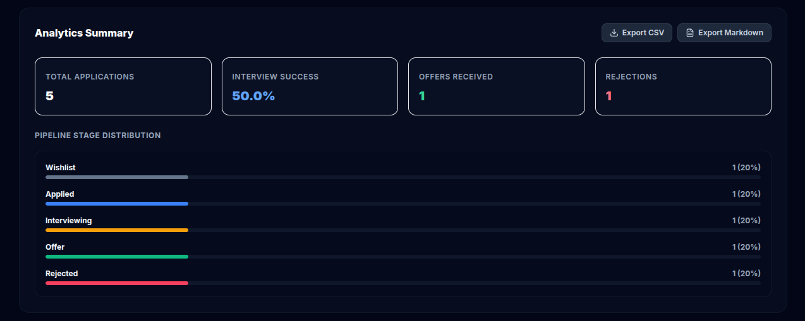
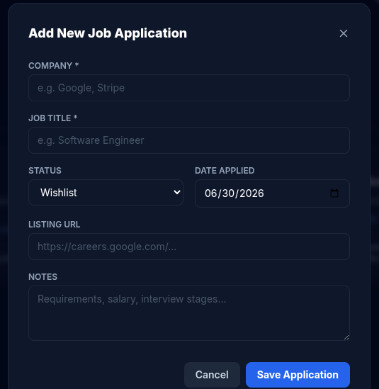

# Job Application Tracker

A modern, fast, and feature-rich Kanban board and analytics dashboard built using **FastHTML**, **Tailwind CSS**, and **SortableJS**, with support for both local **SQLite** and cloud **PostgreSQL (Neon)**.

## Features

- **Kanban Board Layout**: Drag-and-drop job cards across phases: *Wishlist*, *Applied*, *Interviewing*, *Offer*, and *Rejected*.
- **Secure Multi-User Scoping**: Registration and login controllers with SHA-256 hashed password validation. Every workspace, board, and analytic summary is strictly isolated by user ID.
-  **Auto-Seeding for New Environments**: Seeding sample job profiles automatically when the first user registers.
-  **Analytics Dashboard**: Interactive charts tracking metric KPIs (Success Rate, Offers, Rejections) and stage breakdown distributions via **Pandas**.
-  **Universal Data Export**: Download raw CSV worksheets or Markdown summary reports directly from the UI.
-  **PostgreSQL & SQLite Dual-Support**: Auto-detects cloud Neon connection strings or seamlessly defaults back to SQLite locally.
- **Vercel Serverless Ready**: Configured for instant deployment on Vercel.

---

## Visual Preview

